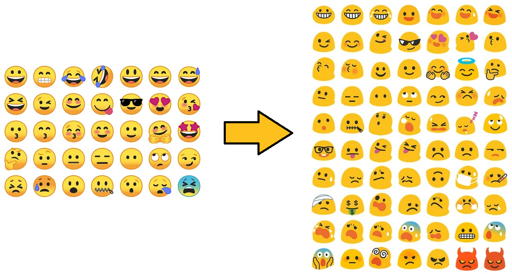

# Blob Emojis Firefox WebExtension

**This add-on replaces latest noto-emoji from Google with old "blobs"(or "potatoes" or "worms" or whatever you call it...) emojis from Android 6.0.1 on the Google website Messages for web.**

## Why this extension

To say no to conformism ! Who wants to have the same boring round-shaped emojis as every other platforms, when you can have those glorious blob emojis ? This extension features the best version of the blobs introduced in Android 4.4 and improved in Android 5.0 and Android 6.0.1 (blobs in Android 7.0 have already lost their custom shapes and their originality).

## What it does

This extension includes:

* a content script, "replace-emojis.js", that is injected into any pages under "messages.android.com" or any of its subdomains
* blob emojis from Android 6.0.1 from https://github.com/googlei18n/noto-emoji/commit/914c9ecb9d5e6d96c972c8df577cc6a36d162ece, completed with newer versions for missing emojis (7.0, 8.0, 9.0)

The content script intercepts HTTP requests to the Google CDN hosting latest Noto emojis (ssl.gstatic.com) and redirects these requests to an archived version of the noto-emoji from this Github repository.

